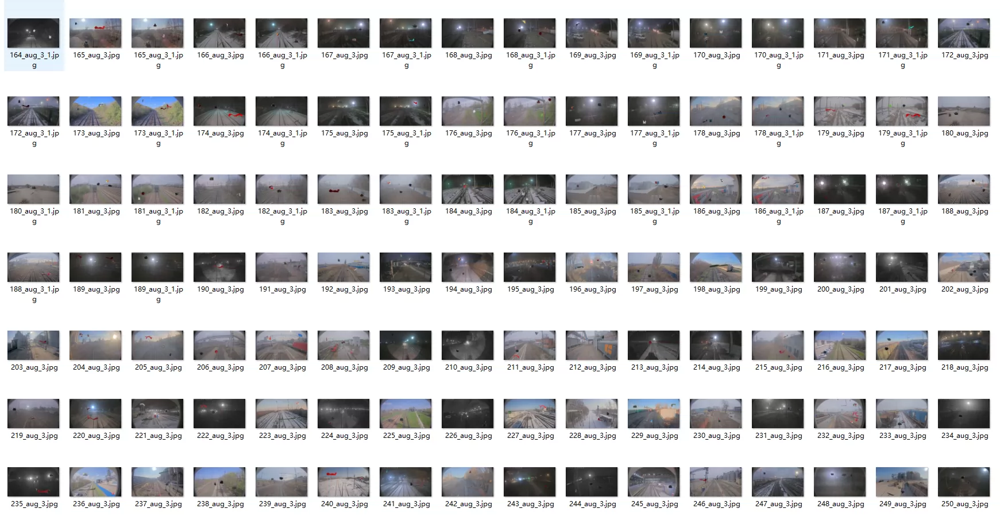
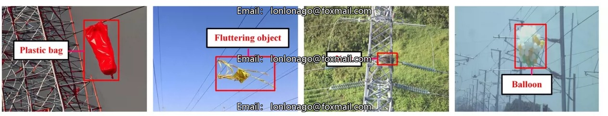
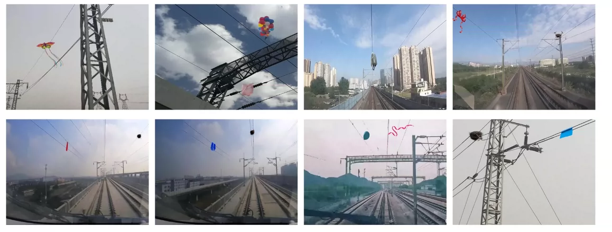
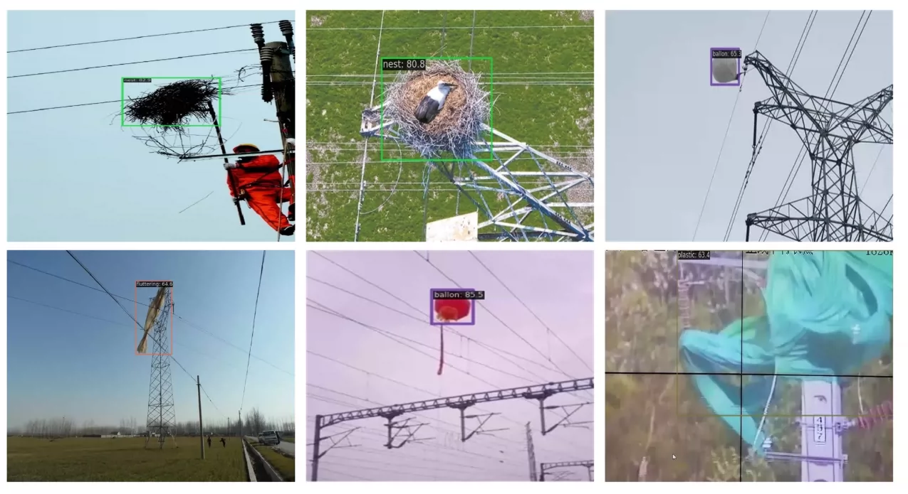
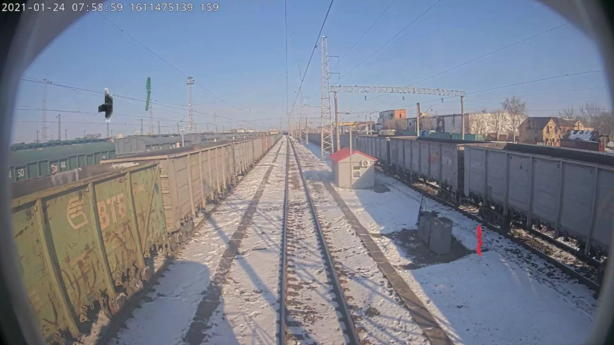
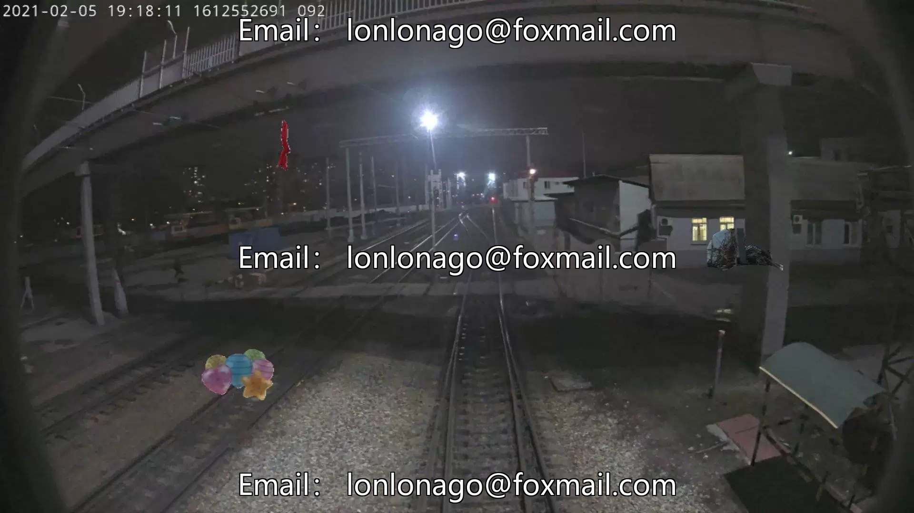
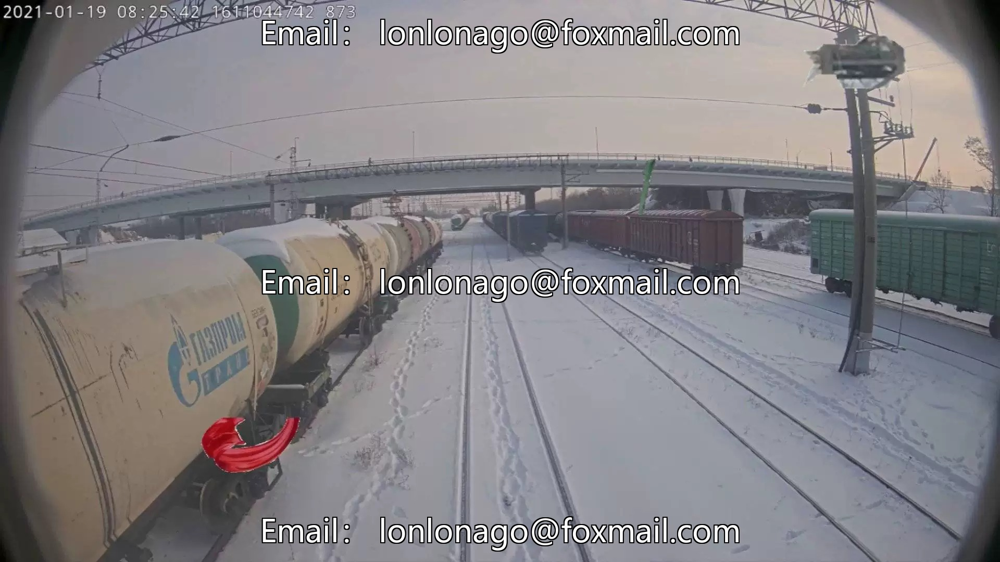

## Body

The railway power transmission line foreign object identification dataset is in COCO format, comprising 14,615 images and 40,541 annotated objects with labels. It is divided into four categories: plastic bags, flying objects such as kites, rope-tied canvas, and fabric materials, bird nests, and balloons.
Please send the original paper to you.
Electronic virtual products are not eligible for returns or exchanges.

## Images

Here is a pay link on Stripe ( https://buy.stripe.com/3cs8yP7sY87d0vu9AB ). Please contact me lonlonago@foxmail.com after funding $89, and I will send you a complete data files , thank you!

